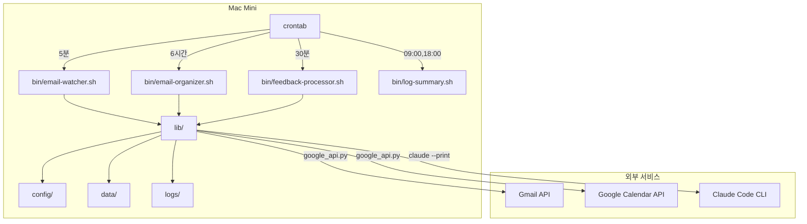
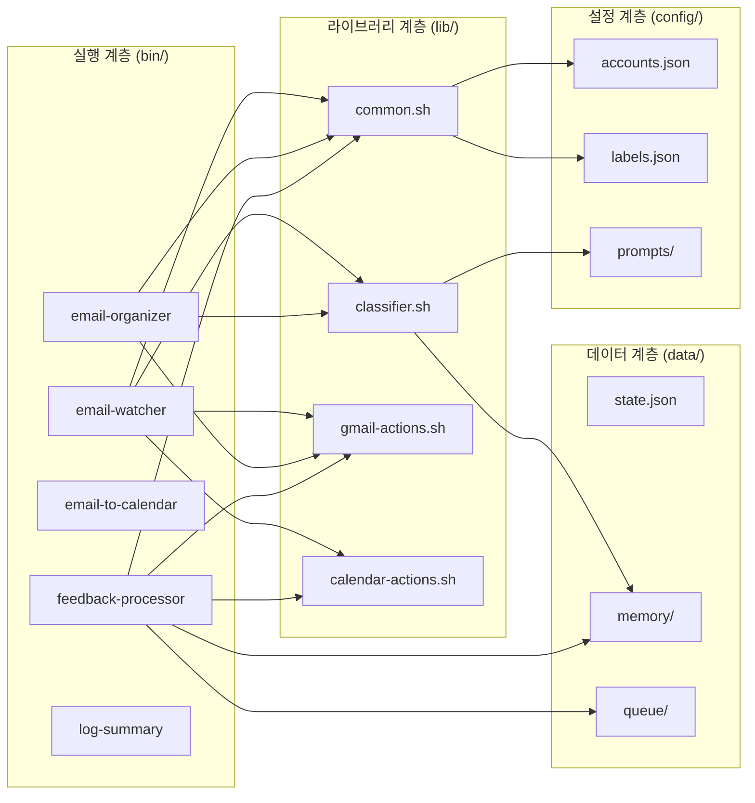

# 시스템 아키텍처

## 개요

Mac Mini에서 crontab으로 구동하는 이메일 자동 분류 + 캘린더 일정 등록 시스템.
외부 의존성은 Google API Python 클라이언트(`lib/google_api.py`)와 `claude` CLI(AI 판단)뿐이다.

## 시스템 구성도

## 계층 구조

## 핵심 컴포넌트

### bin/ — 실행 스크립트

| 스크립트 | 역할 | cron 주기 |
| --- | --- | --- |
| email-watcher.sh | 새 메일 감지 → AI 분류 → 일정 추출 | 5분 |
| email-organizer.sh | 전체 받은편지함 규칙+AI 배치 정리 | 6시간 |
| email-to-calendar.sh | 메일에서 일정 추출 (스캔/확인 모드) | 수동/내부 |
| feedback-processor.sh | 피드백 큐 처리 → 메모리 업데이트 | 30분 |
| log-summary.sh | 로그 요약 생성 | 09:00, 18:00 |

### lib/ — 공통 라이브러리

| 모듈 | 역할 |
| --- | --- |
| common.sh | 경로, 변수, 로깅, 큐 유틸, 메모리 로드 |
| classifier.sh | Claude 프롬프트 빌더, 분류 실행, confidence 기반 분기 |
| gmail-actions.sh | Gmail API 래핑 (검색, 라벨링, 규칙 적용) |
| calendar-actions.sh | Calendar API 래핑 (이벤트 생성, 조회, 큐 분기) |

### config/ — 설정

| 파일 | 역할 |
| --- | --- |
| accounts.json | Gmail 계정 + 캘린더 ID |
| labels.json | 라벨 정의 + 규칙 기반 매핑 + 일정 키워드 |
| prompts/ | Claude 프롬프트 템플릿 3개 |

### data/ — 런타임 데이터

| 경로 | 역할 |
| --- | --- |
| state.json | email-watcher 마지막 체크 시간 |
| memory/ | AI 학습 메모리 (분류 규칙, 발신자 패턴, 수정 이력) |
| queue/ | 피드백 대기 큐 (분류, 캘린더, 라벨) |

## 기술 스택

- **Shell**: Bash + Python3
- **Gmail/Calendar API**: `lib/google_api.py` (google-api-python-client, OAuth2 인증)
- **인증**: `.credentials/credentials.json` (OAuth 클라이언트) + 계정별 토큰 자동 갱신
- **AI 판단**: Claude Code CLI (`claude --print --allowed-tools ""`)
- **스케줄링**: macOS crontab
- **구독**: Claude Max20 (API 비용 0)
