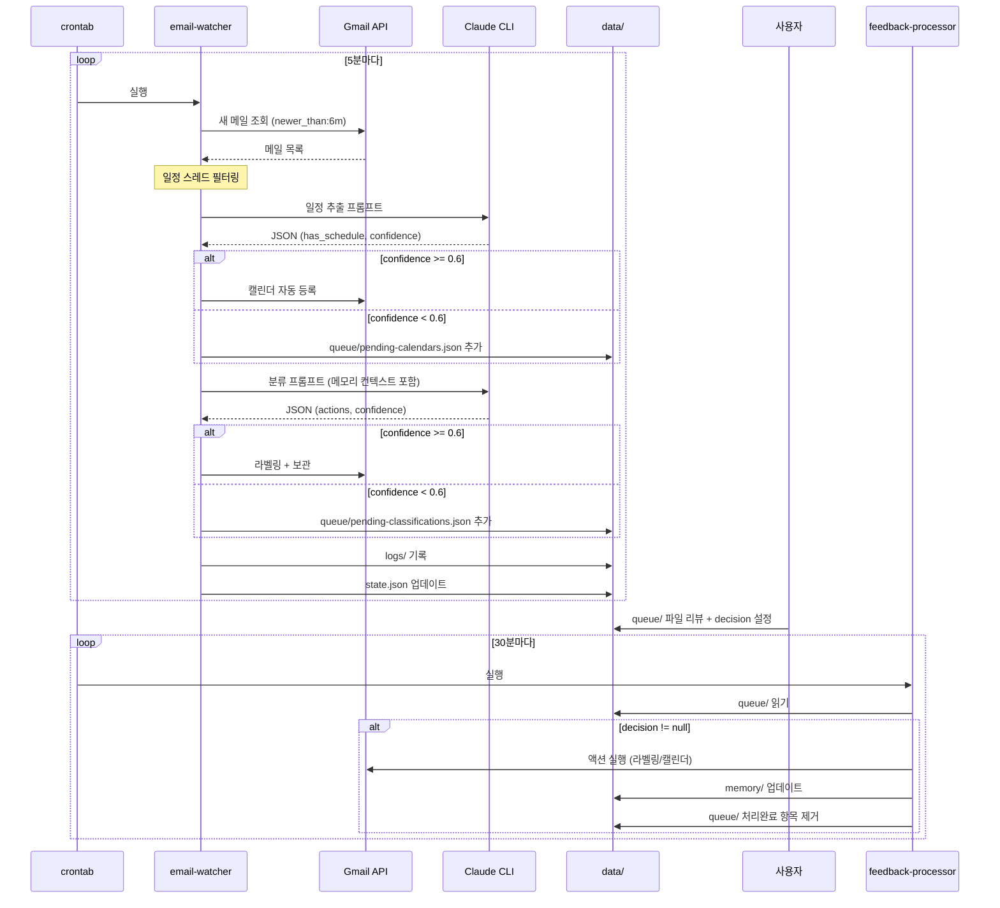
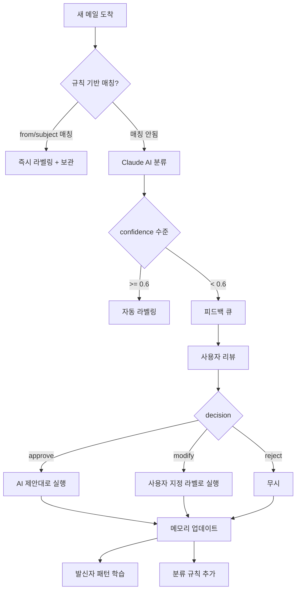
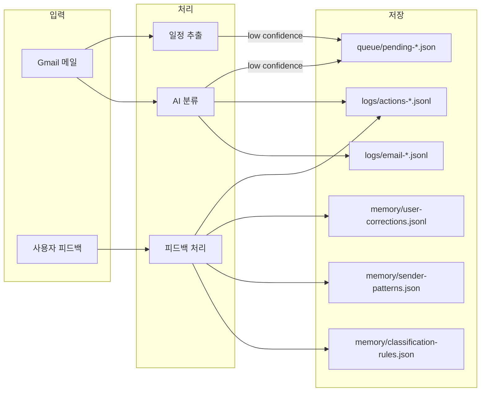

# 데이터 흐름

## 전체 흐름도

## 이메일 분류 흐름

## 데이터 저장 흐름

## 로그 파일 구조

| 파일 | 형식 | 내용 | 보존 |
| --- | --- | --- | --- |
| email-YYYYMMDD.jsonl | JSONL | 이메일 처리 결과 (제목, 발신자, 라벨, urgency) | 일별 |
| actions-YYYYMMDD.jsonl | JSONL | 실행된 액션 (라벨링, 캘린더 등록) | 일별 |
| feedback-YYYYMMDD.jsonl | JSONL | 피드백 처리 결과 | 일별 |
| summary-YYYYMMDD.txt | 텍스트 | 일일 요약 | 일별 |
| cron.log | 텍스트 | cron 실행 stdout/stderr | 누적 |
