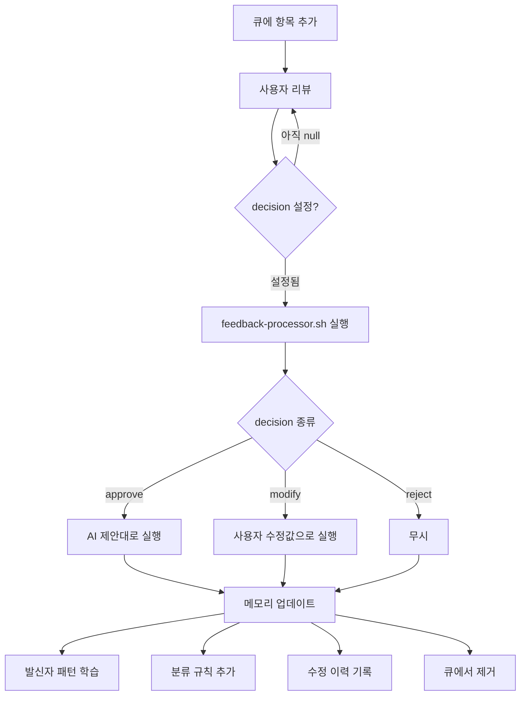

# 피드백 큐 시스템

## 개요

AI가 확신이 낮은 판단(confidence < 0.6)을 사용자에게 확인받기 위한 로컬 큐 시스템.
3종류의 큐 파일로 분류/캘린더/라벨 제안을 관리한다.

## 큐 파일 구조

### pending-classifications.json

AI 분류 confidence가 낮은 이메일.

```json
{
  "pending": [
    {
      "id": "pending-20260325140000-001",
      "created": "2026-03-25 14:00",
      "email_id": "msg_abc123",
      "account": "kevinpark@webace.co.kr",
      "subject": "프로젝트 관련 문의",
      "from": "someone@example.com",
      "ai_suggestion": {
        "label": "확인필요",
        "archive": false,
        "confidence": 0.4,
        "reason": "confidence 0.4 < 0.6"
      },
      "decision": null,
      "user_label": null,
      "user_note": null
    }
  ]
}
```

**사용자 설정 필드**:

- `decision`: `"approve"` / `"reject"` / `"modify"`
- `user_label`: modify 시 사용할 라벨명
- `user_archive`: modify 시 보관 여부 (true/false)
- `user_note`: 메모 (메모리에 reason으로 저장)

### pending-calendars.json

불확실한 일정 제안.

```json
{
  "pending": [
    {
      "id": "cal-20260325140000",
      "created": "2026-03-25 14:00",
      "source_info": "블록체인 세미나 초대 메일",
      "account": "kevinpark@webace.co.kr",
      "proposal": {
        "summary": "블록체인 세미나",
        "start": "2026-04-01T14:00:00+09:00",
        "end": "2026-04-01T16:00:00+09:00",
        "location": "부산테크노파크",
        "description": "이메일에서 추출"
      },
      "calendar_id": "c_ed143b...@group.calendar.google.com",
      "confidence": 0.5,
      "reason": "날짜는 있으나 시간이 추정",
      "decision": null,
      "modified_proposal": null
    }
  ]
}
```

**사용자 설정 필드**:

- `decision`: `"approve"` / `"reject"` / `"modify"`
- `modified_proposal`: modify 시 수정된 일정 (summary, start, end, location 등)

### pending-labels.json

새 라벨 생성 제안.

```json
{
  "pending": [
    {
      "id": "label-20260325140000-세미나-행사",
      "created": "2026-03-25 14:00",
      "suggested_name": "세미나-행사",
      "reason": "같은 유형 메일 5건 발견",
      "sample_subjects": ["블록체인 세미나 초대", "AI 컨퍼런스 안내"],
      "accounts": ["kevinpark@webace.co.kr"],
      "decision": null
    }
  ]
}
```

**사용자 설정 필드**:

- `decision`: `"approve"` / `"reject"`

## 사용 방법

### 방법 1: Claude Code 대화형 (권장)

프로젝트 디렉토리에서 Claude Code를 열고:

```text
"피드백 큐 확인해줘"
"분류 큐에서 광고 3건 승인하고, 계약서는 확인필요로 변경해줘"
"캘린더 제안 중 세미나는 시간을 14시로 수정해서 승인해줘"
```

Claude Code가 CLAUDE.md를 읽고 큐 파일을 파싱하여 대화형으로 처리한다.

### 방법 2: 직접 JSON 편집

```bash
# 1. 큐 확인
cat data/queue/pending-classifications.json | python3 -m json.tool

# 2. decision 필드 설정
# "decision": "approve" 또는 "reject" 또는 "modify"
# modify 시: "user_label": "라벨명" 추가

# 3. 처리 실행
bash bin/feedback-processor.sh
```

## 처리 흐름



## confidence 기준

| 범위 | 처리 | 설명 |
| --- | --- | --- |
| 0.8+ | 자동 처리 | 확신 높음, 즉시 실행 |
| 0.6~0.8 | 자동 처리 + 로그 | 보통, 실행하되 기록 |
| 0.6 미만 | 피드백 큐 | 확신 낮음, 사용자 확인 필요 |

기준값은 `.env`의 `CONFIDENCE_THRESHOLD`로 조정 가능 (기본 0.6).
