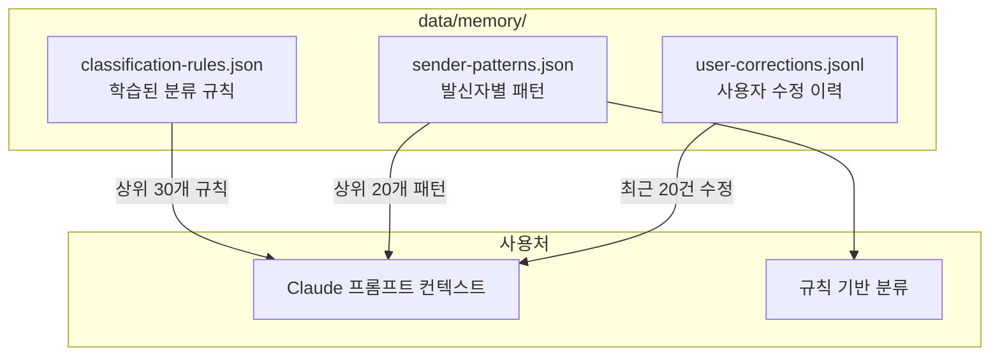
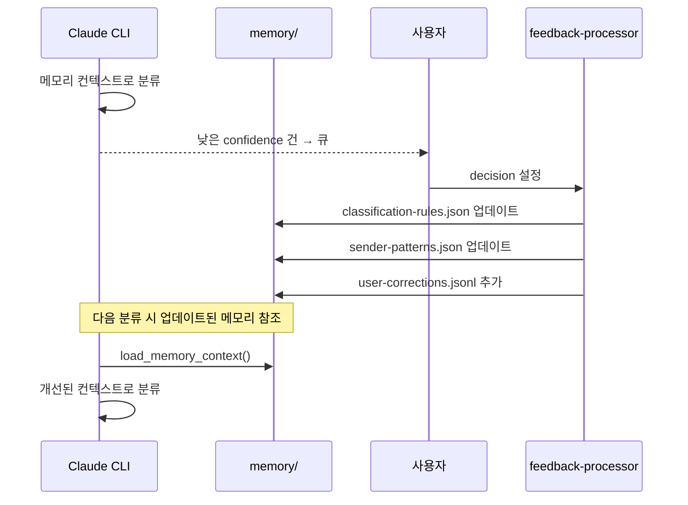

# 메모리/학습 시스템

## 개요

AI 분류의 정확도를 지속적으로 개선하기 위한 파일 기반 메모리 시스템.
별도의 DB나 벡터 스토어 없이 JSON 파일만으로 동작한다.

## 메모리 구조



## 파일별 상세

### classification-rules.json

학습된 분류 규칙. 사용자가 AI 분류를 수정(modify)할 때마다 새 규칙이 추가된다.

```json
{
  "version": 1,
  "last_updated": "2026-03-25 14:00",
  "rules": [
    {
      "id": "rule-001",
      "pattern": {
        "from_contains": "newsletter@company.com",
        "subject_contains": null
      },
      "action": {
        "label": "광고",
        "archive": true
      },
      "confidence": 0.8,
      "source": "user_feedback",
      "created": "2026-03-20",
      "applied_count": 0
    }
  ],
  "label_descriptions": {
    "광고": "광고, 뉴스레터, 프로모션",
    "금융-결제": "결제 내역, 청구서"
  }
}
```

**업데이트 시점**: feedback-processor.sh에서 `decision: "modify"` 처리 시

### sender-patterns.json

발신자별 자동 분류 패턴. 사용자가 approve/modify할 때마다 해당 발신자의 패턴이 갱신된다.

```json
{
  "version": 1,
  "last_updated": "2026-03-25 14:00",
  "patterns": {
    "newsletter@company.com": {
      "label": "광고",
      "archive": true,
      "count": 5,
      "last_seen": "2026-03-25"
    }
  }
}
```

**업데이트 시점**: feedback-processor.sh에서 `decision: "approve"` 또는 `"modify"` 처리 시

### user-corrections.jsonl

사용자 수정 이력 (append-only). 모든 피드백 결정이 기록된다.

```jsonl
{"time":"2026-03-25 14:00","type":"classification","email_id":"msg123","original_label":"광고","corrected_label":"확인필요","decision":"modify","reason":"실제 계약서"}
{"time":"2026-03-25 15:00","type":"classification","email_id":"msg456","original_label":"개발-테크","corrected_label":"개발-테크","decision":"approve","reason":""}
```

**업데이트 시점**: feedback-processor.sh에서 모든 decision 처리 시

## 메모리 → 프롬프트 주입 방식

`lib/common.sh`의 `load_memory_context()` 함수가 메모리를 텍스트로 변환하여 Claude 프롬프트에 주입한다.

```text
=== 학습된 분류 규칙 ===
- from:newsletter@company.com → 광고 archive:True
- from:updates@service.com → 개발-테크 archive:True

=== 발신자 패턴 ===
- newsletter@company.com → 광고 archive:True
- bank@example.com → 금융-결제 archive:True

=== 최근 사용자 수정 (이 패턴을 반영해) ===
- 주의: 실제 계약서였음 (광고 → 확인필요)
```

이 컨텍스트가 분류 프롬프트에 포함되어 Claude가 과거 피드백을 참고하여 분류한다.

## 학습 루프



## 메모리 관리

- **classification-rules.json**: applied_count 기준으로 정렬, 상위 30개만 프롬프트에 주입
- **sender-patterns.json**: count 기준 정렬, 상위 20개만 주입
- **user-corrections.jsonl**: 최근 20건만 주입. 파일 자체는 append-only로 히스토리 보존
